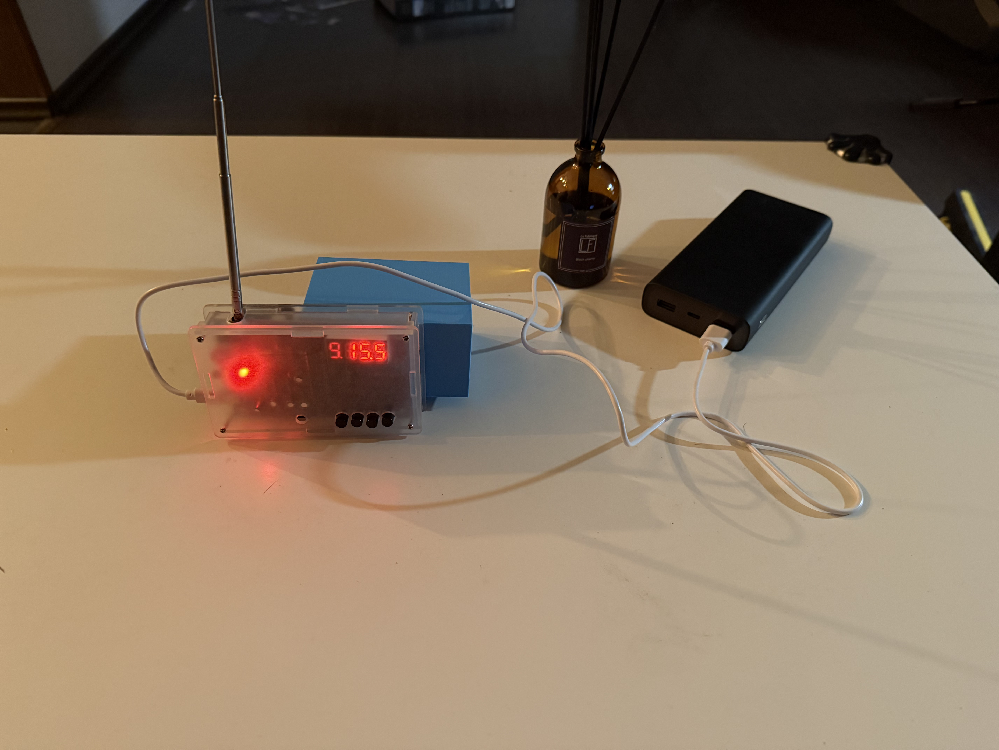

# Vape&Vibes

  
  

## Задача

Создать компактное устройство, совмещающее классический FM/AM‑радио‑приёмник и держатель для одноразовой электронной сигареты, используя доступные комплектующие и настольный 3d‑принтер.

## Использованные инструменты/оборудование

* 3d принтер
* **Solidworks** (моделирование отсека)
* **Orcaslicer**
* Клей
* Waka(электронная сигарета)

## Как пользоваться

1. **Зарядка** — micro‑USB 5 В, ток ≤ 1 А.
2. **Радио** — кнопка `PWR`, колёсико `TUNE` для частоты.
3. **E‑cig** — вставьте сверху

## Замечания по безопасности

* Проект рассчитан **только для лиц 18+**, так как содержит вейп‑устройство.
* Соблюдайте местные законы об использовании электронных сигарет.

## Возможные улучшения

* Подсветка уровня заряда (NeoPixel)
* Зарядка e‑cig через USB‑C док‑станцию
* Радио‑Bluetooth‑приёмник вместо FM/AM
